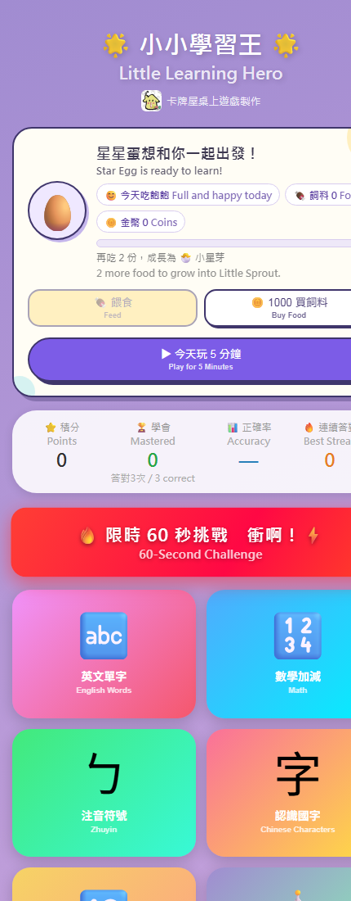
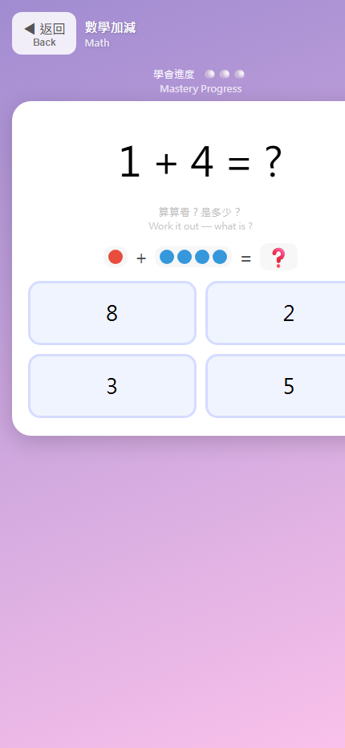
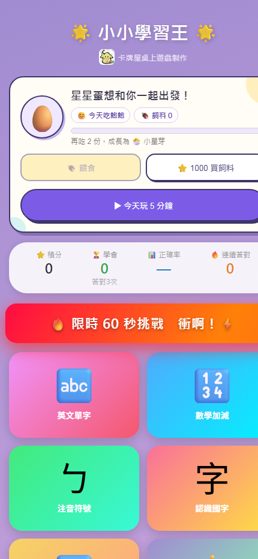

# 小小學習王 Little Learning Hero

**超小、免安裝、任何有瀏覽器的機器都能執行。**

小小學習王把完整的兒童學習 App 濃縮在約 1.3 MB 的靜態檔案中。無需註冊、無需安裝、沒有複雜環境，只要開啟網頁即可使用；手機、平板、Windows、macOS、Linux 與 Chromebook 都能玩，載入一次後還可離線學習。

在極小體積裡，仍提供英文、數學、注音、國字等 20 多種中英雙語玩法，適合 3–5 歲孩子以點選方式學習。

## 線上版本

- 正式站：https://bghut.com/kids/
- GitHub Pages：https://boardgamehut-ui.github.io/little-learning-hero/

## 畫面預覽

| 中英雙語首頁 | 數學答題畫面 | 寵物養成與每日旅程 |
|---|---|---|
|  |  |  |

## 最強特色

- 整套 App 約 1.3 MB，網路慢也能快速載入
- 不用下載、不用安裝、不用建立帳號，點開即玩
- 只需現代瀏覽器，手機、平板與各種電腦皆可執行
- 支援 PWA 與離線使用，載入一次後沒有網路也能學
- 純前端設計，學習紀錄保存在使用者自己的瀏覽器
- 20+ 種中英雙語學習玩法
- 五分鐘每日學習旅程
- 寵物養成、金幣與獎章
- 錯題複習與學習紀錄

## 使用方式

直接開啟 `index.html` 即可執行；也能放進任何靜態網站空間，不需要資料庫、建置工具或伺服器執行環境。

> GitHub Pages 是靜態版本，因此伺服器排行榜與意見回報功能會自動退回本機模式；完整功能請使用正式站。
